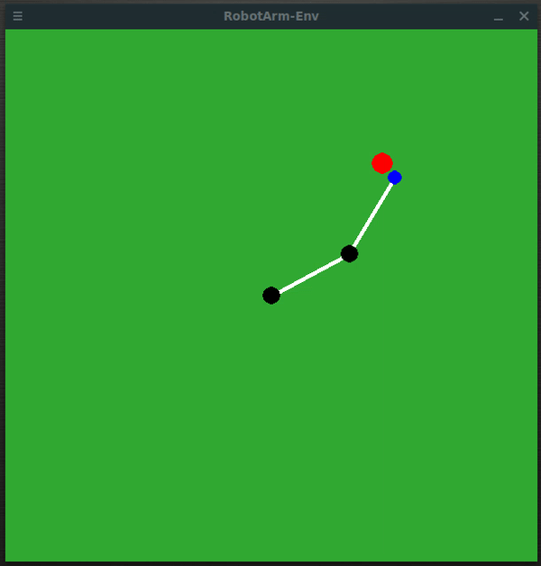
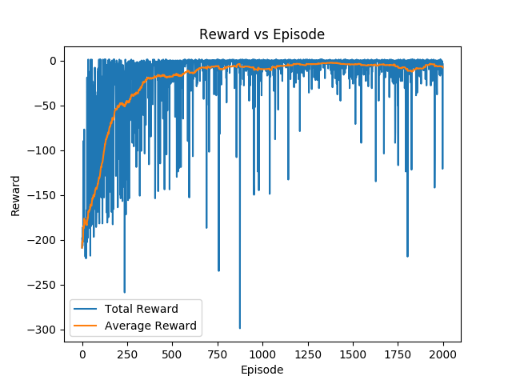

# Deep Q Network Agent for Solving 2D Robot Arm Reacher

**Overview**

This is an example of Deep Q learning algorithm for solving reaching target tasks on the 2D robot arm. The environment is available through this link [https://github.com/ekorudiawan/gym-robot-arm](https://github.com/ekorudiawan/gym-robot-arm)

Example of agent performance is shown in this animation

**Result**

Here is an example result of DQN agent performance that was trained after 2000 episodes.

**Dependencies**

* OpenAI Gym
* PyGame
* PyTorch 1.4.0